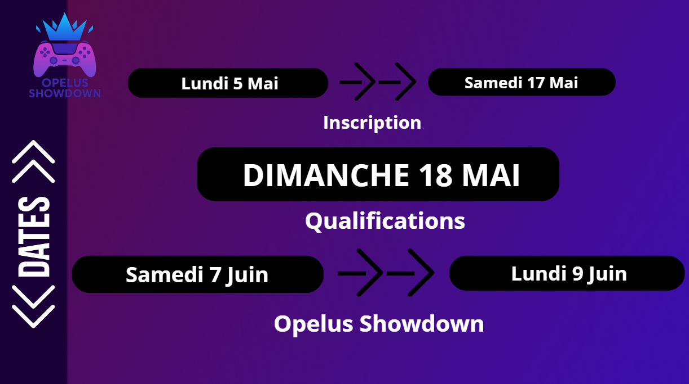

# 📅 Format

Le tournoi se dérouleras sur 3 jours voici les informations sur le format : \
\
Les inscriptions pour les qualification débuterons le Lundi 5 Mai jusqu'au Samedi 17 Mai\
\
Des qualification auront lieu le Dimanche 18 Mai afin de savoir qui seront les 30 duos qui participeront au tournois officiel \
\
**Les dates et horaires du tournois sont :**  \
\
Samedi : 18h - 0h&#x20;
\
Dimanche : 13h - 19h / 19h30 - 00h00&#x20;
\
Lundi : 13h - 17h30  / 18h - 20h30 final / 21h - 00h00&#x20;

<figure><figcaption></figcaption></figure>
