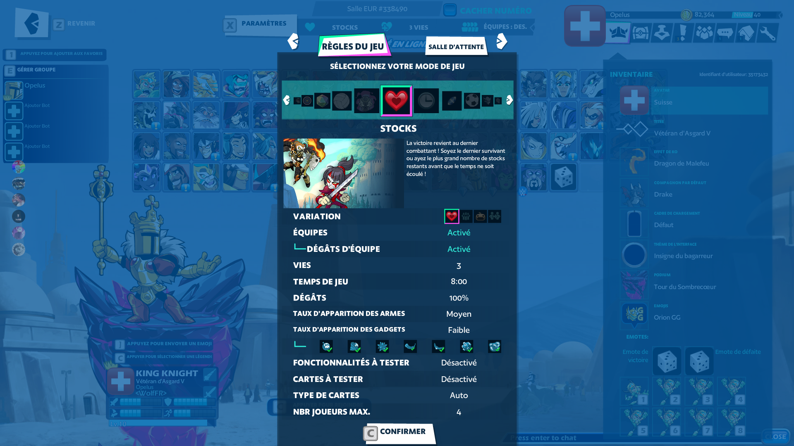

# 👊 Brawlhalla

Chaque duo affronte son vis a vis !\
\
Ce qui donne 3 gagnants et 3 perdants. 

Les 3 gagnants s'affrontent tous pour faire top 1/2/3 \
Les 3 perdants s'affrontent tous pour faire top 4/5/6 

Si égalité de points le gagnant du vis a vis passe devant.

<figure><figcaption></figcaption></figure>
