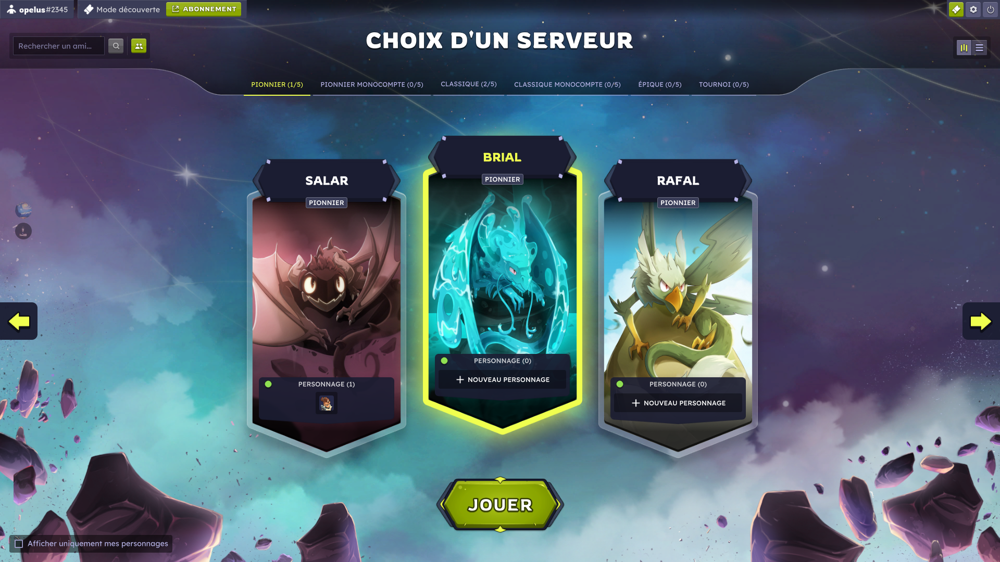
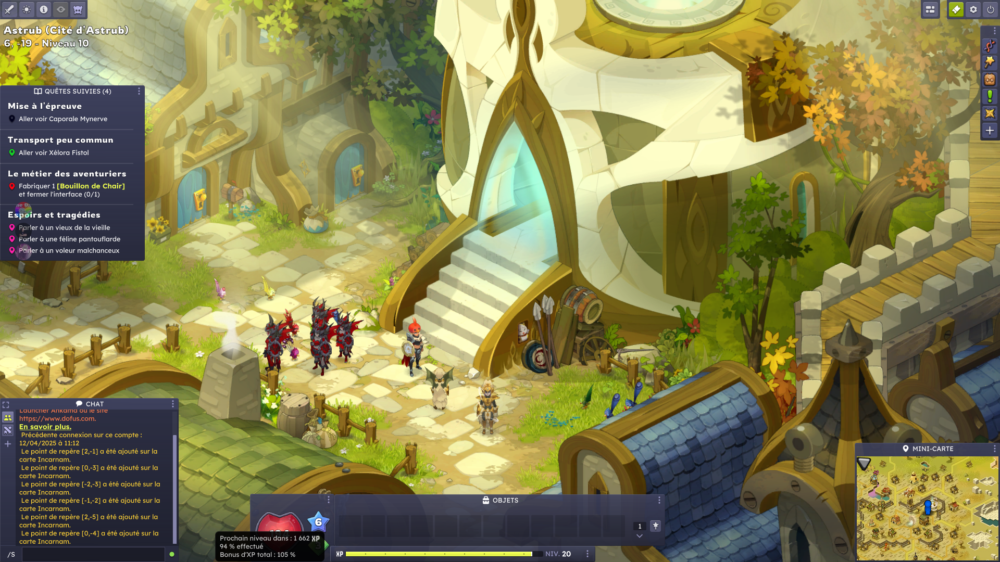
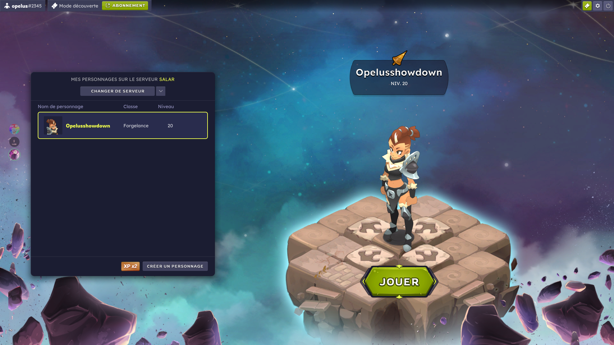
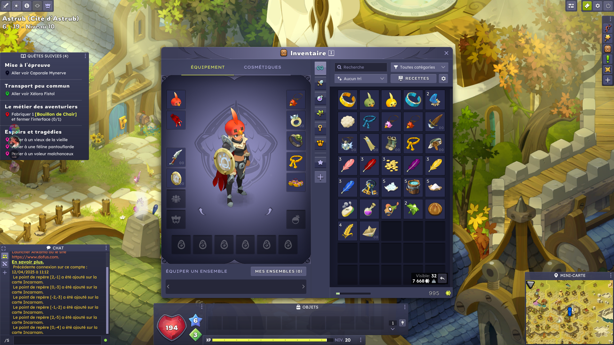

# 🥚 Dofus

Il s'agit de notre speedrun, il faudra trouvé le moyen le plus rapide d'arrivé level 25 en 30min tous en vous faisant le meilleur stuff possible pour les phase d'après qui seront du pvp 2v2/1v1 avec le même personnage.\
\
Lors de cette phase 1 ce sera un **speedrun de 30 min** pour arrivé le plus vite au **level 25** \
\
le score sera le cumul du temps d'arrivé des deux joueurs du duo\
\
**Règle du speedrun :**&#x20;

Tous manquement aux règles sera passible d'exclusion de la cup interdit : \

* Team hors votre duo&#x20;
* Échange hors votre duo
* HDV&#x20;

Démarrer en partage d'écran sur ce screen&#x20;

<figure><figcaption></figcaption></figure>

Fin de run envoyer les screens suivant :

**Level ingame avec le curseur sur le barre d'xp / personnage / inventaire**

<figure><figcaption></figcaption></figure> <figure><figcaption></figcaption></figure> <figure><figcaption></figcaption></figure>

